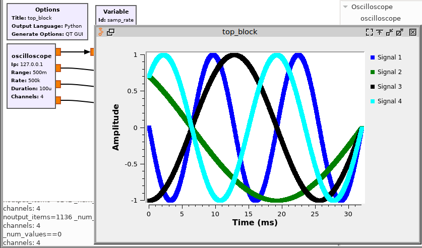
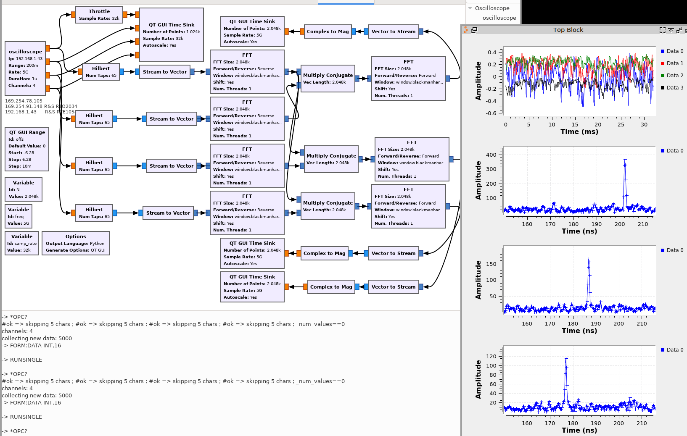

# gr-oscilloscope38
Using an oscilloscope as Software Defined Radio source for GNU Radio 3.8

Assumes the availability of RPC for communication over VXI11 with an oscilloscope, provided 
by `apt-get install libtirpc-dev` on Debian/GNU Linux.

Tested on Rohde & Schwarz RTO2034 and RTE1054, will most probably work on any RT series
oscilloscopes. Originally developed for the Agilent 54855DSO [1] but not tested after
adding support for R&S instruments. Select which brand is used with the `#define` flags
in the lib/ directory source code (`#define rohdeschwarz` is exclusive with `#define agilent`).

For those wanting to test gr-oscilloscope with no hardware access, a TCP server generating
dummy data (sine waves) is available in examples. Compile manually (`gcc -o tcp_server 
tcp_server.c -lm`) and execute (`./examples/tcp_server`) to connect the server to port 9999 of
the localhost. TCP/IP dummy data communication is activated by selecting as IP address
of the gr-oscilloscope "oscilloscope" block 127.0.0.1.

Dummy TCP signal source to check the block is operational:

Noise measurement for Time Delay measurement by correlating the channels:

[1] Weike Feng, Jean-Michel Friedt, Grigory Cherniak, and Motoyuki Sato

Passive bistatic radar using digital video broadcasting–terrestrial receivers as general-purpose software-defined radio receivers

Review of Scientific Instruments 89, 104701 (2018); https://doi.org/10.1063/1.5048132 available at
http://jmfriedt.free.fr/dvbt_hardware.pdf
